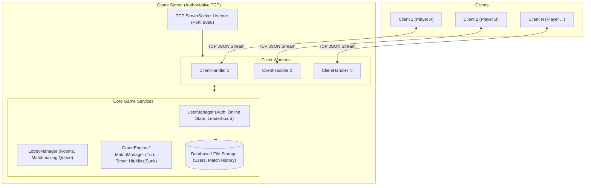
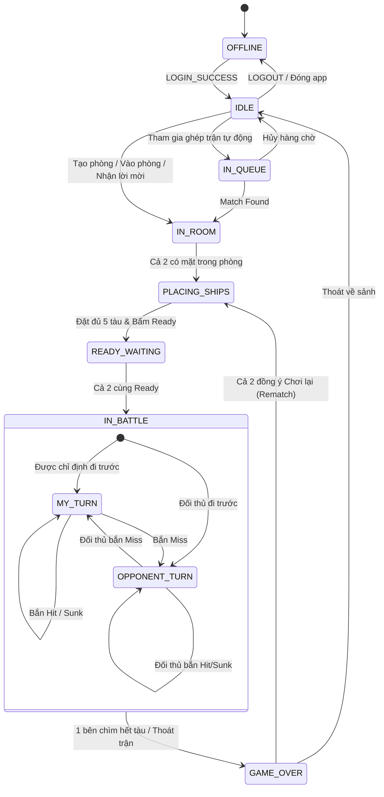
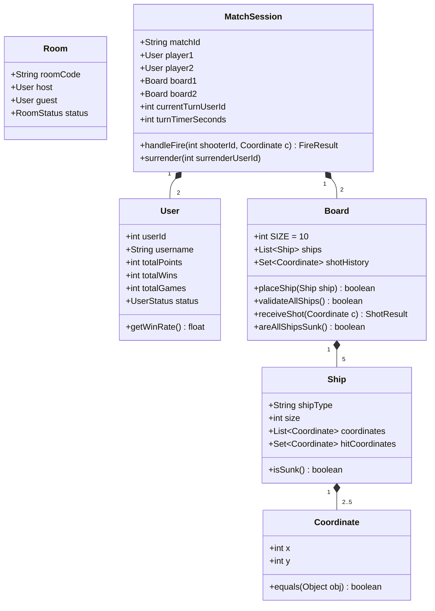

# THIẾT KẾ KIẾN TRÚC HỆ THỐNG (SYSTEM ARCHITECTURE)

Tài liệu này phác thảo kiến trúc kỹ thuật, mô hình luồng đa nhiệm (concurrency), các thực thể dữ liệu và máy trạng thái (State Machine) của hệ thống Battleship Online.

---

## 1. MÔ HÌNH TỔNG QUAN HỆ THỐNG (HIGH-LEVEL ARCHITECTURE)

Hệ thống hoạt động theo mô hình **Client - Server tập trung (Authoritative Server)**:
- **Server:** Là trọng tài tối cao. Lưu trữ dữ liệu tài khoản, quản lý danh sách online, điều phối ghép trận, kiểm tra tính hợp lệ của việc đặt tàu và phát bắn, đếm ngược Timer 15s, tính điểm và lưu lịch sử trận đấu.
- **Client:** Đóng vai trò giao diện hiển thị (UI) và nhận tương tác của người chơi. Client **không bao giờ tự ý quyết định kết quả bắn**; mọi thao tác bắn chỉ gửi tọa độ lên Server và đợi Server thông báo kết quả. Điều này ngăn chặn hoàn toàn gian lận (cheat nhìn trộm tàu đối thủ).

---

## 2. THIẾT KẾ PHÍA SERVER (SERVER CONCURRENCY & MODULES)

### 2.1. Mô hình Đa luồng (Multi-threading Model)
- **Main Listener Thread:** Lắng nghe kết nối TCP trên cổng định sẵn (mặc định `8888`). Khi có kết nối mới `accept()`, tạo một `ClientHandler` chạy trên Thread riêng (hoặc cấp phát từ `ExecutorService / ThreadPool`).
- **ClientHandler Thread:** Mỗi kết nối Client duy trì 1 luồng đọc liên tục từ `InputStream` bằng `readLine()`. Khi nhận được 1 dòng JSON:
  1. Parse JSON sang đối tượng Message.
  2. Router/Dispatcher chuyển message tới Service tương ứng (`AuthService`, `LobbyService`, `GameService`).
  3. Ghi log và trả kết quả phản hồi qua `OutputStream`.
- **Game Timer Scheduler:** Sử dụng `ScheduledExecutorService` (hoặc Timer) để đếm 15 giây cho mỗi lượt bắn trong các trận đấu đang diễn ra. Khi hết 15s mà người chơi chưa gửi lệnh bắn, Timer kích hoạt cơ chế Timeout (tự động bắn/chuyển lượt).

### 2.2. Các Service & Module cốt lõi
1. **`UserManager`**:
   - Quản lý danh sách tài khoản đã đăng ký.
   - Quản lý các phiên kết nối đang Active (`Map<Integer, ClientHandler> onlineClients`).
   - Cập nhật và broadcast trạng thái (`IDLE` <-> `BUSY`).
   - Tính toán và cung cấp Bảng xếp hạng.
2. **`LobbyManager`**:
   - Quản lý các phòng chơi tùy biến (`Map<String, Room> activeRooms`).
   - Tạo Room Code ngẫu nhiên không trùng lặp (ví dụ: chuỗi 6 ký tự `[A-Z0-9]`).
   - Quản lý hàng chờ ghép trận tự động (`Queue<ClientHandler> matchmakingQueue`).
3. **`GameManager / MatchSession`**:
   - Mỗi trận đấu là 1 thực thể `MatchSession` quản lý 2 người chơi.
   - Lưu trữ 2 bàn cờ bí mật (`Board player1Board`, `Board player2Board`).
   - Điều khiển lượt bắn (`currentTurnPlayerId`).
   - Hủy trận và xử thua khi 1 bên ngắt kết nối (`disconnect`) hoặc bấm Thoát.
4. **`StorageManager`**:
   - Lưu trữ dữ liệu tài khoản và lịch sử trận đấu (có thể dùng SQLite, MySQL hoặc JSON/File).

---

## 3. THIẾT KẾ PHÍA CLIENT (CLIENT ARCHITECTURE)

Client được chia làm 2 tầng rõ ràng:
1. **Network Layer (Background Thread):**
   - Duy trì Socket kết nối tới Server.
   - Luồng đọc (`Reader Thread`) liên tục nhận chuỗi JSON từ Server, giải mã thành event và bắn về UI Layer thông qua Callback hoặc Event Dispatcher.
   - Hàm `sendMessage(Message msg)` gửi JSON kèm `\n` lên Server.
2. **UI Layer (Main Thread):**
   - Đảm bảo các cập nhật giao diện được đẩy về UI Thread (ví dụ trong Java Swing dùng `SwingUtilities.invokeLater()`).
   - Các màn hình (Screens/Views):
     - **Login/Register Screen:** Form đăng nhập.
     - **Lobby Screen:** Danh sách online, nút Tạo phòng, Nhập mã phòng, Tìm trận tự động, Bảng xếp hạng.
     - **Ship Placement Screen:** Bản đồ 10x10, thao tác kéo thả/click đặt 5 tàu, xoay ngang/dọc, nút Ready.
     - **Battle Screen:** 2 bàn cờ (Bàn cờ của mình hiển thị tàu + vị trí địch bắn; Bàn cờ đối phương hiển thị sương mù + các điểm mình đã bắn: Hit/Miss/Sunk), thanh hiển thị lượt, đồng hồ đếm ngược 15s.
     - **Game Over Dialog:** Thông báo Thắng/Thua, nút Chơi lại và nút Thoát.

---

## 4. MÁY TRẠNG THÁI (FINITE STATE MACHINE - FSM)

### 4.1. Trạng thái của Người chơi (Player Lifecycle)

---

## 5. CẤU TRÚC DỮ LIỆU CỐT LÕI (CORE DATA MODELS)

